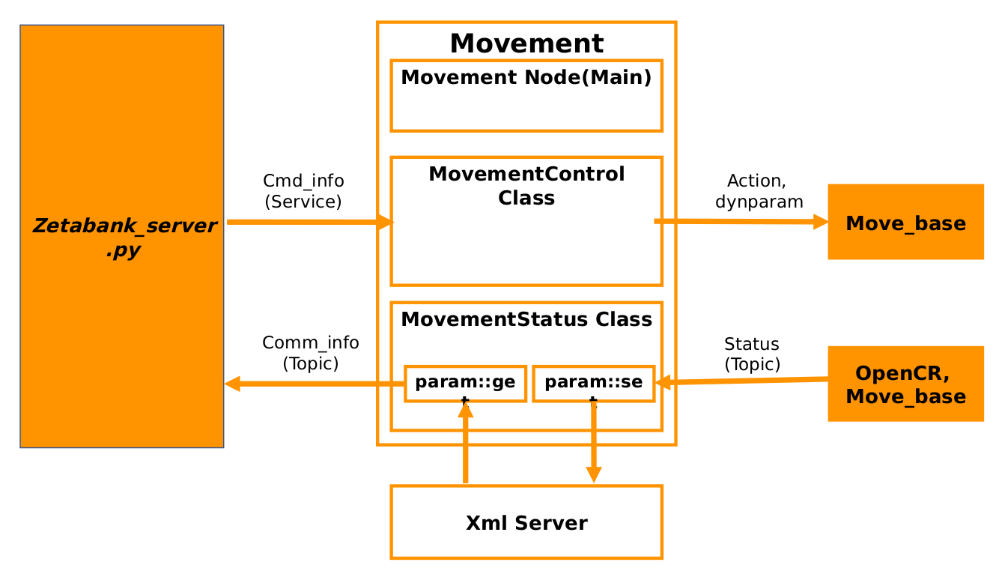

# Structure

# Jetson installation

## ROS
https://www.jetsonhacks.com/2018/04/27/robot-operating-system-ros-on-nvidia-jetson-tx-development-kits/

## ZED
https://github.com/stereolabs/zed-ros-wrapper

# Requirement

<pre><code>
sudo apt-get install ros-kinetic-move-base -y 
sudo apt-get install ros-kinetic-gmapping -y 
</pre></code>

If you include the packages about navigation-kinetic-devel, you don't need you install below components

<pre><code>
sudo apt-get install ros-kinetic-amcl -y 
sudo apt-get install ros-kinetic-map-server -y 
sudo apt-get install ros-kinetic-dwa-local-planner -y 
sudo apt-get install ros-kinetic-tf2 -y 
sudo apt-get install ros-kinetic-tf2-ros -y
sudo apt-get install ros-kinetic-global-planner -y 
sudo apt-get install ros-kinetic-sensor-msgs -y 
sudo apt-get install ros-kinetic-rosserial-python -y
sudo apt-get install ros-kinetic-range-sensor-layer -y
sudo apt-get install ros-kinetic-diagnostic-updater -y
sudo apt-get install ros-kinetic-interactive-marker -y
sudo apt-get install ros-kinetic-gazebo-ros -y
</code></pre>

## SSH Setting

<pre><code>

sudo apt-get install ssh -y 

ssh remote_id@remote_ip

</code></pre>

## Time synchronization in embedded PC
<pre><code> 
sudo rdate -s time.bora.net
sudo hwclock 
</code></pre>

## Authorize the external device & usb port
<pre><code>
// OpenCR
sudo chmod a+rw /dev/ttyACM*

// Lidar(RPLidar)
sudo chmod a+rw /dev/ttyUSB*

</code></pre>

-------------
# How to excute the functions of 'zetabank robot'

## Bring up 
### Execute the real robot

1. <pre><code> roslaunch zetabank_bringup zetabank_robot.launch --screen </code></pre>

### Execute the virtual model in simulator

1. <pre><code> roslaunch zetabank_gazebo zetabank_with_tf.launch --screen </code></pre>

-------------
## Mapping
### Mapping in real or simulator

2. <pre><code> roslaunch zetabank_slam zetabank_slam.launch --screen </code></pre>

### Teleoperation using keyboard

3. <pre><code> roslaunch zetabank_teleop zetabank_teleop_key.launch --screen </code></pre>

### RViz about mapping

4. <pre><code> rosrun rviz rviz -d `rospack find zetabank_slam`/rviz/zetabank_slam.rviz </code></pre>

-------------
## Navigation
### Navigation in real

2.0 <pre><code> roslaunch zetabank_navigation total_navigation.launch --screen </code></pre>

#### Navigation for slow speed
2.1 <pre><code> roslaunch zetabank_navigation slow_navigation.launch --screen </code></pre>

#### Navigation for nomal speed
2.2 <pre><code> roslaunch zetabank_navigation normal_navigation.launch --screen </code></pre>

#### Navigation for fast speed
2.3 <pre><code> roslaunch zetabank_navigation fast_navigation.launch --screen </code></pre>

#### Navigation to use sonar sensor(TEST)
2.4 <pre><code> roslaunch zetabank_navigation sonar_navigation.launch --screen </code></pre>

### Navigation in simulator

2. <pre><code> roslaunch zetabank_navigation zetabank_nav_simul.launch --screen </code></pre>

##### 3. If you want to stick the tf coordinate, you can command a below sentence. 
<pre><code> rosrun map_tf frame_tf2_broadcaster </code></pre>

##### 4. If you autonomously want to move the robot according to designed coordinates, you can command a below sentence.
<pre><code> rosrun autonomous_navigation simple_navigation_goals </code></pre>

##### 5 Spread the particles for initializing the covariance of AMCL

<pre><code> rosrun autonomous_navigation initializeAMCLParticles </code></pre>

### RViz about Navigation

6. <pre><code> rosrun rviz rviz -d `rospack find zetabank_navigation`/rviz/zetabank_nav.rviz </code></pre>

-------------

### Processing with the top

## TCP/IP Communication

Server:

1. <pre><code> roslaunch zetabank_communication zetabank_server.launch --screen </code></pre>

Client:

2. <pre><code> python client.py host_ip port </code></pre>

-------------
## Autonomous Driving & Movement management

1. <pre><code> rosrun autonomous_navigation movement </code></pre>

-------------

## Total exexution file 
Launch file including rviz, navigation, initializationAMCL, server node of communication, movement node of autonomous_navigation to execute totally nodes in simulation.

<pre><code> roslaunch zetabank_communication total_server.launch --screen </code></pre>

